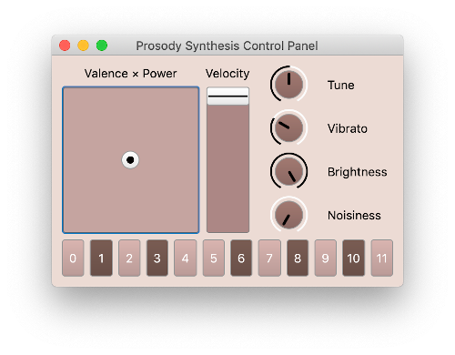

# Prosody Synthesis Module

An audio synthesis module for prosody generation. It takes emotion and melody as
inputs and maps the emotion to multiple timbre parameters (e.g. formants, attack
time, spectrum features) which then be sent to the software synthesizer
implemented on SuperCollider.

## Demo
The following audio clips are generated by the system. (The melodies are pre-defined.)
- [happy](./demo/happy.mp3)
- [calm](./demo/calm.mp3)
- [sad](./demo/sad.mp3)
- [angry](./demo/angry.mp3)

## Screenshot
This is the screen shot of the control panel made in SuperCollider:



## References

These are the two main references of this project:

Formant modulation:
- Goudbeek, M., Goldman, J. P., & Scherer, K. R. (2009). Emotion dimensions and formant position. In Tenth Annual Conference of the International Speech Communication Association.

Timbre modulation (attack, hf-lf ratio)
- Eerola, T., Ferrer, R., & Alluri, V. (2012). Timbre and affect dimensions: Evidence from affect and similarity ratings and acoustic correlates of isolated instrument sounds. Music Perception: An Interdisciplinary Journal, 30(1), 49-70

## Instruction

This project provides:
1. A SuperCollider `.scd` file that comes with a `SynthDef` and OSC receiving
   functionality.
3. A SuperCollider GUI control panel.
2. Two Python OSC modules that handle GUI-to-Synth and MIDI-to-Synth respectively.
3. A Python prosody feature mapping module.

Workflow:
```
SuperCollider GUI -> (OSC) -> Feature Mapping and OSC Transmit -> (OSC) -> SuperCollider Synth
```
or
```
MIDI -> (mido) -> Feature Mapping and OSC Transmit -> (OSC) -> SuperCollider Synth
```

## Set-up

### Prerequisite
Make sure you have Python and SuperCollider installed.

In `python/` directory, run the following command to install Python dependencies:
``` shell
$ pip install -r requirements.txt
```

Most of the time, you need a configuration file to make it work properly. To do
this, put a file `config.yml` in the project root. Here's a configuration
example:

``` yaml
osc_bridge_ip: 127.0.0.1
osc_bridge_port: 8088
sc_ip: 127.0.0.1
sc_port: 57120

midi_device: MPKmini2
```

Usually you only need to change the `sc_port` and `midi_device` entries.

To check all the available devices on your computer, go to your Python REPL,
type in the following commands:

``` python
>>> import mido
>>> mido.get_output_names()
```

### Melody and Emotion Input

#### Option 1: GUI Control Panel

Run `sclang/vsynth_gui.scd` on SuperCollider. You can run this either on
SuperCollider IDE or through command line. For command line, make sure you are
at the project root directory, and use the following command:

``` shell
$ /path/to/sclang sclang/vsynth_gui.scd
```

Also run `python/gui_to_sclang` to enable the OSC transmit.

#### Option 2: MIDI Input

Make sure you have installed all the required packages. Run
`python/midi_to_sclang` to enable MIDI input. If there's no more argument, the
program reads only MIDI messages from the hardware. You can also give it a file
path, such as `../midi`, where the program will watch the file change and send
the MIDI messages stored in the newly-created MIDI file.

Some CC numbers are used to send control parameters:
- CC1 Valence
- CC2 Power
- CC3 Tune (microtone control, ±100 cents, value 64 corresponds to 0 cent)
- CC4 Vibrato
- CC5 Brightness
- CC6 Noisiness

### Sound Synthesis

Run `sclang/vsynth_osc.scd` on SuperCollider. You can run this either on
SuperCollider IDE or through command line. For command line, make sure you are
at the project root directory, and use the following command:

``` shell
$ /path/to/sclang sclang/vsynth_osc.scd
```

Once you start running the code, there's one line in the output that tells you
the port SuperCollider is listening on (`Listening on: xxxxx`). Then check your
`config.yml`, make sure the port specified in `sc_port` entry is the same as
this port.
